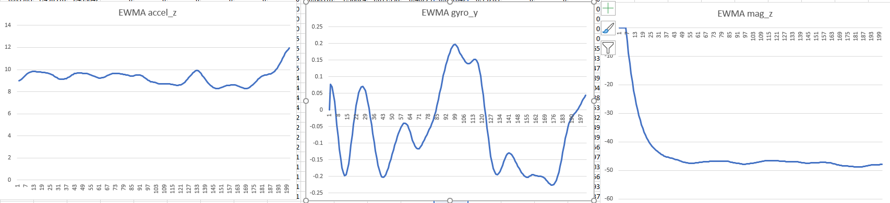
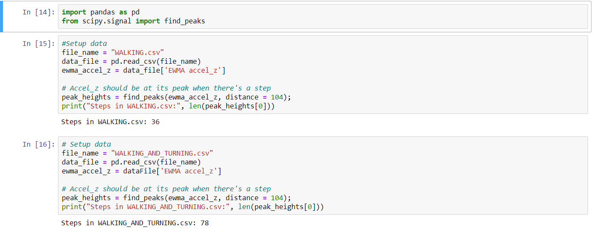
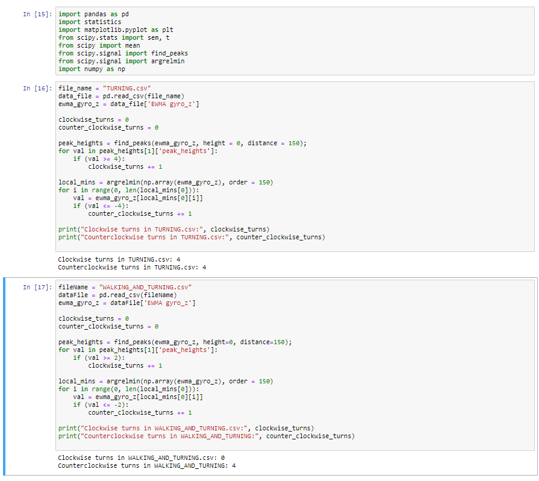
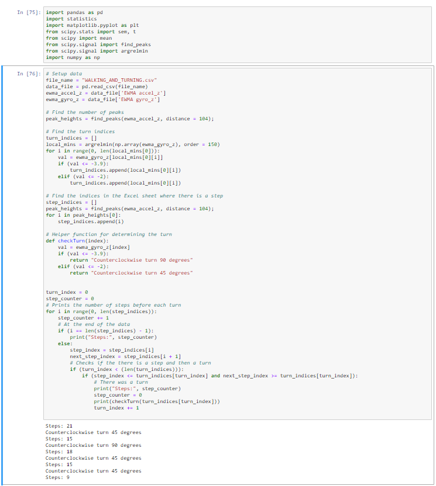
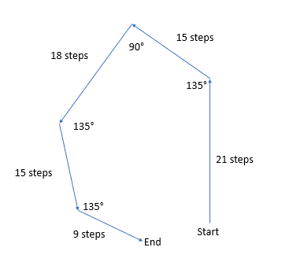

# Mobile-Sensor-Analysis

1. WALKING.csv, TURNING.csv, and WALKING_AND_TURNING.csv contain the sensor data. In columns k -> s, I have smoothed the data using exponentially-weighted moving average with an alpha of 0.9.
    - WALKING.csv contains data gathered while holding the phone face-up and walking in the direction of the top of the phone.
    - TURNING.csv contains data gathered while turning the phone 90 degrees clockwise 4 times and 90 degrees counterclockwise 4 times. 
      The phone was face-up on a table.
    - WALKING_AND_TURNING.csv contains data gathered while walking and turning. All turns are a multiple of 45 degrees in either direction.
  
  2. Steps.ipynb contains the algorithm to find the number of steps contained in WALKING.csv and WALKING_AND_TURNING.csv.
  
  3. Turns.ipynb contains the algorithm to find the number of turns contained in TURNING.csv and WALKING_AND_TURNING.csv.
  
  4. Walking_and_turning.ipyn contains the algorithm to find the number of steps and turns in WALKING_AND_TURNING.csv. The number of steps before each turn are included as well as the angle of each turn.
  
  5. Write-up.docx includes explanations and diagrams for each algorithm as well as the results!

## Write-up

1. For smoothing, I used exponentially weighted moving average (EWMA) with an alpha of 0.9. After trying simple moving average and EWMA with an alpha of 0.1, I decided to use EWMA with an alpha of 0.9 since it gave me a graph with minimal &quot;bumps.&quot; I have attached WALKING.csv, TURN.csv, and WALKING\_AND\_TURNING.csv to this submission. Columns K through S in each file contain the EWMA values. If you plan to run the scripts provided, please download the Excel sheets attached to this submission and place them in the same directory as the scripts since the scripts depend on the EWMA values calculated in those Excel sheets. Here are the graphs for EWMA accel\_z, gyro\_z, and mag\_z.

2. I have attached my algorithm for finding the number of steps in WALKING.csv and WALK\_AND\_TURNING.csv. I wrote the algorithm in Python using Jupyter Notebooks. To run the script, run Steps.ipynb and look at the second cell to get the number of steps in WALKING.csv and look at the third cell to get the number of steps in WALKING\_AND\_TURNING.csv. I have attached pictures of the output below. To calculate the number of steps, I decided to use the EWMA accel\_z values since those values should correspond to the phone bouncing up and down due to walking. Therefore, I used a Python library called scipy to find the number of peaks. To reduce the number of peaks found, I set the distance between two peaks to be at least 104 data points apart since I don&#39;t think people can walk more than 2 steps in one second (200 data points = 1 second). The number of steps ended up corresponding with the number of peaks I counted in the corresponding graphs. Also, given the number of seconds in the data samples, the results seemed reasonable. As shown below, the number of steps for WALKING.csv is 36 and the number of steps for WALKING\_AND\_TURNING.csv is 78.

3. I have attached my algorithm for finding the number turns in TURNING.csv and WALK\_AND\_TURN.csv. I also wrote this algorithm in Python using Jupyter Notebooks. Run Turns.ipynb and look at cells 2 and 3 to see the number of clockwise and counterclockwise turns in TURNING.csv. I decided to use the EWMA gyro\_z values since the phone was turned while face-up on a surface. Looking at the gyro\_z graph of TURNING.csv, I deduced that a value of about 4 was a 90-degree clockwise turn and a value of about -4 was a 90-degree counterclockwise turn. So, my algorithm finds all the peeks and local minimums in both csv files and compares their values to 4 and -4. Like part 2 of this write-up, I had to specify a minimum distance between two peeks to eliminate peeks that are close too close to each other. For TURNING.csv, I got 4 90-degree clockwise turns and 4 90-degree counterclockwise turns. For WALKING\_AND\_TURNING.csv, I noticed that the minimums of the graph were about -2 and -4. As a result, I concluded that -2 corresponded to a 45-degree counterclockwise turn and -4 corresponded to a clockwise turn. I ended up with 0 clockwise turns and 4 counterclockwise turns for WALKING\_AND\_TURNING. The results all matched up with the number of peaks in the gyro\_z graphs.

4. Here is the algorithm and output for WALKING\_AND\_TURNING.csv. The person holding the phone took 21 steps, took a 45-degree counterclockwise turn, 15 steps, a 90-degree counterclockwise turn, 18 steps, a 45-degree counterclockwise turn, 15 steps, a 45-degree counterclockwise turn, and 9 steps. 

Here is the corresponding plot.

